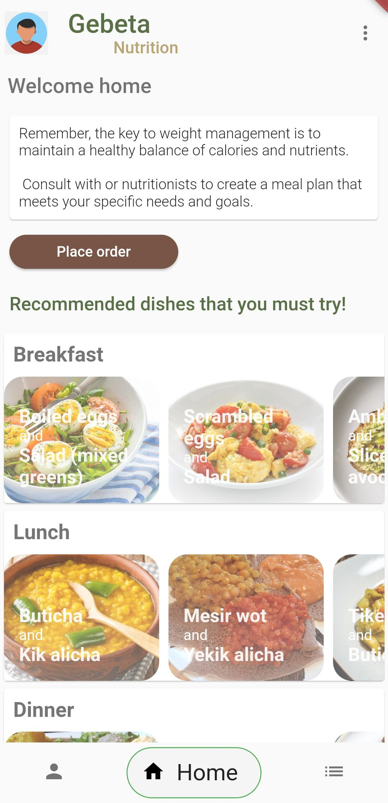
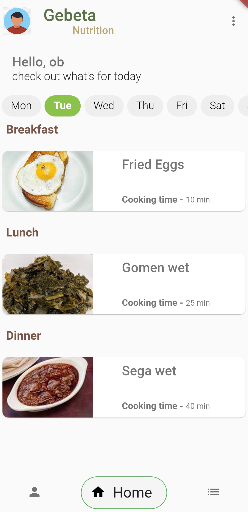
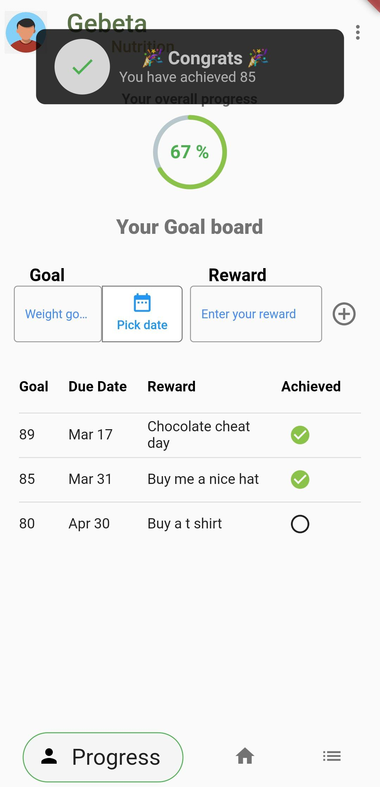
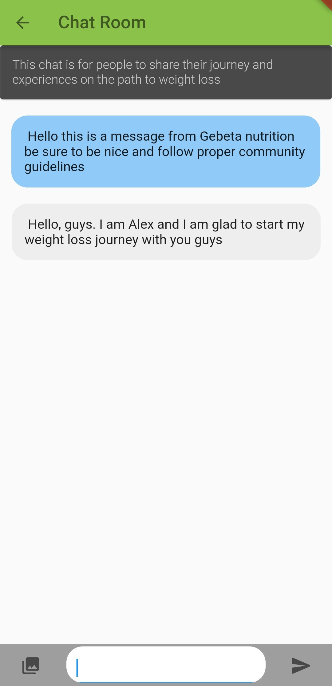
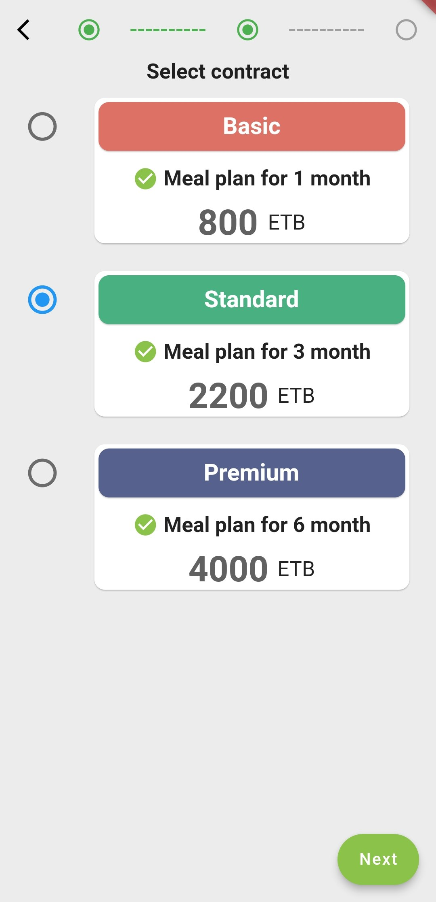

# Gebeta Nutrition

Gebeta Nutrition is a subscription-based meal planning and progress tracking application designed to help users achieve their weight goals. By offering personalized meal plans and a structured tracking system, it ensures a seamless nutrition journey tailored to each user’s needs.

## Table of Contents
* [General Info](#general-information)
* [Technologies Used](#technologies-used)
* [Features](#features)
* [Screenshots](#screenshots)
* [Acknowledgements](#acknowledgements)
* [Contact](#contact)

## General Information
- **Gebeta Nutrition** is a **meal planning and progress tracking app** designed to cater to individual weight goals.
- Users can subscribe to a **personalized nutrition plan** based on their weight class, ensuring tailored meal suggestions.
- A **recipe library** is available for non-subscribers to explore and prepare meals.
- The app includes a **social chat system**, allowing users to celebrate milestones and connect with others in weight goal communities.
- Seamless **subscription payments** are integrated via **Chapa API**, ensuring a hassle-free experience for users.

## Technologies Used
- **Flutter** – Cross-platform mobile development
- **Firebase** – Backend services for authentication and data storage
- **Chapa API** – Secure online payment processing for subscriptions

## Features
Gebeta Nutrition offers an extensive range of features to support users in their nutrition journey:
- **Tailored Meal Plans** – Subscribers receive **professionally curated meal plans** designed for their weight goals.
- **Extensive Recipe Library** – Default users can browse and cook from a diverse collection of recipes.
- **Progress Tracking** – Users can **track their weight changes** and **monitor progress** over time.
- **Community & Social Chat** – Engage in **weight goal communities** to share progress and celebrate milestones.
- **Secure Online Payments** – Seamlessly **subscribe** to personalized meal plans using **Chapa API**.
- **User Convenience** – All features, including payment processing and tracking, are **integrated within the app**.

## Screenshots

| Home Page              | Meal Plan Page        | Progress Tracking Page  |
| ---------------------- | ---------------------- | ---------------------- |
|  |  |  |

| Recipe Details        | Community Chat        | Payment Page           |
| ---------------------- | ---------------------- | ---------------------- |
|  |  |  |

## Acknowledgements
- Special thanks to **Chapa API** for enabling seamless **subscription-based payments** within the app.
- Appreciation goes to the contributors who helped bring **Gebeta Nutrition** to life, making nutrition planning more accessible and effective.

## Contact
Created by [@OBRND](https://github.com/OBRND) - feel free to contact me!  

